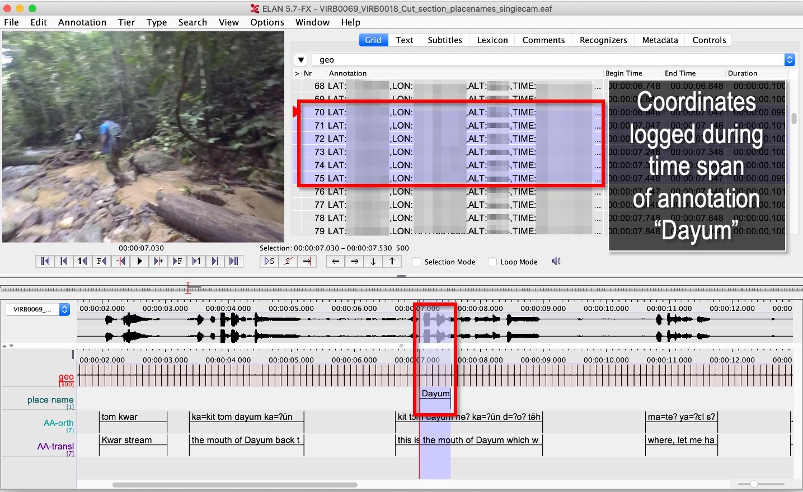
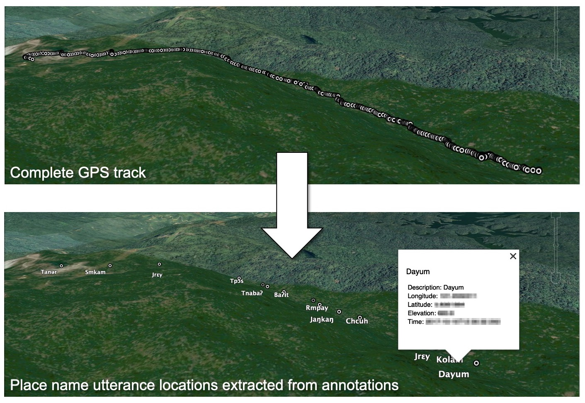

## GeoELAN

**IMPORTANT:** GoPro's newest camera **HERO12 Black DOES NOT have a GPS module** as far as I know (the HERO11 Black does have GPS and is still being sold at the time of writing). This means the main workflow in **GeoELAN WILL NOT WORK with a GoPro HERO12 Black**. I don't know what GoPro's plans are, but I will look into alternative solutions (e.g. using a parallel GPS log from a fitness watch or similar).

> **Note 1:** This is GeoELAN's new home. The [old one](https://github.com/jenslar/geoelan) will no longer be updated.

> **Note 2:** Documentation may be temporarily outdated. I'm working on updating this (and to make it less verbose).

> GeoELAN is multi-functional command-line tool that can
> - **geo-reference** ELAN-annotations of GoPro and VIRB footage (i.e. annotate GPS logs) and **generate annotated points, lines, or circles**.
> - **inspect** the raw content of your GoPro GPMF data, or Garmin FIT-files.
> - **locate and match** all relevant files belonging to the same recording session irrespective of file name (clips, telemetry-files).
> - automatically **join clips** for a specific recording session, and **generate an ELAN-file** with linked media.

### Acknowledgements

GeoELAN was developed with support from the [Bank of Sweden Tercentenary Foundation](https://www.rj.se/en/) (Grant nos [NHS14-1665:1](https://www.rj.se/en/grants/2015/language-as-key-to-perceptual-diversity-an-interdisciplinary-approach-to-the-senses/) and [IN17-0183:1](https://www.rj.se/en/grants/2017/digital-multimedia-archive-of-austroasiatic-intangible-heritage-phase-ii-seeding-multidisciplinary-workspaces/)).

We would also like to acknowledge the [The Language Archive](https://archive.mpi.nl/tla/), Max Planck Institute for Psycholinguistics in Nijmegen for their tireless efforts in developing [ELAN](https://archive.mpi.nl/tla/elan), and making it available for free.

### Overview

[GeoELAN](https://github.com/jenslar/geoelan) is a command-line tool for annotating action-camera GPS logs using [ELAN](https://archive.mpi.nl/tla/elan), see [Larsson et al 2021](https://doi.org/10.1080/13645579.2020.1763705). Simply record a video with a supported device and annotate the recording in ELAN as per usual. Any annotation - be it an utterance, a plant that is in view, or anything else that was captured - can now be automatically geo-referenced.

The nature of the workflow also means consultants not physically present at the the time of recording may evaluate observed phenomena to be geo-referenced post-collection. As the name implies, the free [ELAN](https://archive.mpi.nl/tla/elan) annotation software plays a central role and is required to annotate events. The final output can be points, polylines, or polygons (circles), in the form of annotated [KML](https://www.ogc.org/standards/kml/) and [GeoJSON-files](https://geojson.org). Henceforth, "GoPro" refers to a GoPro Hero 5 Black or later, and "VIRB" to the Garmin VIRB Ultra 30. Note that while GeoELAN functionality differs slightly between Garmin and GoPro due to differences in formats and file structure, its main purpose is intact for either brand.

Annotating placename utterances in ELAN, to be geo-referenced by GeoELAN


Using GeoELAN to geo-reference ELAN annotations


### Supported action cameras

Supported cameras are **GoPro** (Hero 5 Black and later) and **Garmin VIRB** (VIRB Ultra 30). Ensure that the GPS is turned on and has acquired satellite lock.

### Manual
See the `doc` directory for the full manual, example walkthrough and a brief A4-guide.

### Installation
See the `bin` directory for pre-compiled executables for Linux (Ubuntu Intel x86), macOS (Intel x86 + Apple Silicon), and Windows (Intel x86).

#### Compile and install from source

You can also compile GeoELAN yourself. Depending on your operating system, this may require installing additional software, and a basic understanding of working in a terminal. The basic steps are:

1. Install the [Rust toolchain](https://www.rust-lang.org)
2. Get the source: `git clone https://github.com/jenslar/geoelan`
3. `cd geoelan` (you should be in the folder containing `Cargo.toml`)
4. `cargo build --release`
5. `cargo install --path .` (optional, makes `geoelan` [a global command](https://doc.rust-lang.org/cargo/commands/cargo-install.html))

## Requirements

- An action camera with a built-in GPS. Supported devices are:
    -  [GoPro](https://gopro.com) Hero Black 5 or newer (Max, and Fusion cameras have not been tested)
    -  [Garmin VIRB Ultra 30](https://www.garmin.com/en-US/p/522869/pn/010-01529-03) ([documentation](https://support.garmin.com/en-US/?partNumber=010-01529-03&tab=manuals)) (**discontinued**)
- [ELAN](https://archive.mpi.nl/tla/elan) ([documentation](https://archive.mpi.nl/tla/elan/documentation))
- [FFmpeg](https://www.ffmpeg.org) (for concatenating video)
- [Rust toolchain](https://www.rust-lang.org) (optional, only required for compiling GeoELAN from source)

### Quick help
- Usage: `geoelan COMMAND OPTIONS`. E.g. to geo-reference an ELAN-file:
  - GoPro: `geoelan eaf2geo --eaf MyElanFile.eaf --video GH01000.MP4`
  - VIRB: `geoelan eaf2geo --eaf MyElanFile.eaf --fit MyFitFile.fit`
- Running `geoelan` with no options will display an overview.
- Running `geoelan COMMAND --help` displays an overview for that command, e.g.:
  - `geoelan eaf2geo --help`.
- Available commands: `cam2eaf`, `eaf2geo`, `locate`, `inspect`, `plot`, `manual`
- The `geoelan` executable contains the full PDF manual for convenience: `geoelan manual --pdf`

## Example walkthrough

This section describes how GeoELAN can be used to geo-reference ELAN-annotations. Please refer to the detailed sections if you get stuck. Remember that all input video clips must be the unprocessed, original MP4 (GoPro + VIRB) and FIT-files (VIRB). The so-called FIT-files mentioned throughout this manual are where the VIRB logs GPS-data and other kinds of telemetry during a recording session. These need to be matched to the corresponding video recording. GeoELAN will help with all of this, with the exception of annotating your data.

Note that some commands differ slightly between GoPro and VIRB.

The basic steps are:

1. Record video with a recent GoPro or VIRB.
2. Use GeoELAN to concatenate the video clips and generate an ELAN-file.
3. Annotate spatially interesting sections in ELAN.
4. Use GeoELAN to geo-reference the annotations, resulting in annotated KML and GeoJSON files.

Input files:
- **GoPro**:
    - `GH010026.MP4`, any clip in a recording session (remaining clips located automatically)
- **VIRB**:
    - `VIRB0001-1.MP4`, any clip in a recording session (remaining clips located automatically)
    - FIT-file with corresponding GPS-data (located automatically)

Output files:
- **GoPro + VIRB**:
    - KML and GeoJSON files with ELAN annotation content synchronised and mapped to the corresponding points as descriptions.

## Step 1/3: Generate an ELAN-file with linked media files

In step 1 we will locate all video clips (GoPro + VIRB) and FIT-files (VIRB) that belong to a specific recording session, process these, join clips, and generate an ELAN-file with linked media files.

**Command**
```sh
geoelan cam2eaf --video INDIR/VIRB_OR_GOPRO_CLIP_.MP4 --indir INDIR/ --outdir OUTDIR/
```

**Output files GoPro**
```
OUTDIR/GH010026/
├── GH010026.mp4             High-resolution video (concatenated)
├── GH010026_LO.mp4          Low-resolution video for ELAN (concatenated)
├── GH010026.wav             Extracted audio for ELAN (concatenated)
├── GH010026.eaf             ELAN-file with pre-linked media files
├── GH010026.kml             Overview KML-file with all points logged during the recording session
└── GH010026.txt             FFmpeg concatenation file, paths to input clips
```

**Output files VIRB**
```
OUTDIR/VIRB0001-1/
├── 2017-05-29-13-05-42.fit  FIT-file with corresponding telemetry
├── VIRB0001-1.mp4           High-resolution video (concatenated)
├── VIRB0001-1_LO.mp4        Low-resolution video for ELAN (concatenated)
├── VIRB0001-1.wav           Extracted audio for ELAN (concatenated)
├── VIRB0001-1.eaf           ELAN-file with pre-linked media files
├── VIRB0001-1.kml           Overview KML-file with all points logged during the recording session
└── VIRB0001-1.txt           FFmpeg concatenation file, paths to input clips
```

By specifying any clip in the recording session  via `--video`, remaining files will be automatically located, if they exist in the input directory `INDIR/`. The result, including an ELAN-file with linked media files, will be saved to the output directory `OUTDIR/`. The default behaviour is to link low-resolution clips (`.GLV`/`.LRV`) in the ELAN-file.

## Step 2/3: Annotate events in ELAN

Next, use ELAN with the ELAN-file from step 1 to annotate events that should be geo-referenced in step 3. Feel free to create any tier structure you may need. Tokenized tiers can not be geo-referenced, but otherwise any tier is fine, including deeply nested, referred tiers.

GeoELAN will geo-reference annotations from a single tier (selectable in step 3). Thus, if you want to generate a KML-file with e.g. indigenous place names mentioned on-site during the recording, those place names must be limited to a single tier. If there are other spatial categories or groupings you wish to explore, simply create a new tier for each. In step 3 you can then re-run GeoELAN as many times as required, then select a different tier and/or options on each run.

When the annotations are geo-referenced in step 3, the annotation values in the selected tier will be used as descriptions for the synchronized, corresponding points in the KML and GeoJSON-files. Points corresponding to unannotated sections of the ELAN-file will either be discarded or have no description, depending on which options you use in step 3.

An annotated event can relate to anything observed in the recording and can be represented as either points or polylines in the output KML-file. If you are unsure which best applies to what you have in mind for your data, or how this may affect how you annotate, here are a few ideas for each kind.

> **Points** could concern documenting:
> - **the location of a plant or a geographical feature**, e.g. annotate the timespan either is visible in the video.
> - **an uttered place name or an animal cry**, e.g. annotate the timespan of the on-site utterance or cry.
> 
> **Lines** could concern documenting:
> - various **types of movement through the landscape**. To annotate the movement of "walking up-hill" as it is observed visually in the recording, set the annotation's start time at the bottom of the hill and its end at the top, or for as long as the motion can be observed.
> - a **narrative reflecting on the immediate surroundings** as they change over time. E.g. comments on visible landscape features, or perhaps the re-construction of an historical event as it unfolded over space and time.


## Step 3/3: Generate a KML-file from geo-referenced ELAN annotations

Now that we have a few annotations, GeoELAN will geo-referenence these by determining which points were logged within each annotation's timespan. Note the different commands between GoPro and VIRB.

This is where you choose the approriate geographical representations for your annotated phenomena. Here are suggestions for the examples in step 2.

> **Points**:
> - the location of a plant or a geographical feature
> - an uttered place name or an animal cry
> 
> To get a single, average coordinate for each annotation, use the `--geoshape point-single` option.
> 
> **Lines**:
> - types of movement through the landscape
> - narrative reflecting on the immediate surroundings 

There are other options, such as _circle_ output. It is the same as point output with the difference that radius and height can be specified (all circles will have the same size). For a more detailed overview of the possibilities, see the `--geoshape` option for the command _eaf2geo_. Experiment! If you realise one representation is not appropriate after all, re-run GeoELAN with a different option.

### VIRB

**Command**
```sh
geoelan eaf2geo --eaf VIRB0001-1.eaf --fit 2003-01-02-12-00-00.fit --geoshape point-single
```

**Output files**
```
OUTDIR/VIRB0001-1/
├── ...                              Existing files
├── VIRB0001-1_point-single.kml      New KML-file, one point per annotation in the selected tier
└── VIRB0001-1_point-single.geojson  New GeoJSON-file, one point per annotation in the selected tier
```

### GoPro

**Command**
```sh
geoelan eaf2geo --eaf GH010026.eaf --gpmf INDIR/GH010026.MP4  --geoshape point-single
```

> **Important:** `GH010026.MP4` **must be an unedited GoPro clip from the recording session**, as it was generated by the camera, **not** the video linked in your ELAN file. E.g. the same one specified in step 1.

**Output files**
```
OUTDIR/GH010026/
├── ...                            Existing files
├── GH010026_point-single.kml      New KML-file, one point per annotation in the selected tier
└── GH010026_point-single.geojson  New GeoJSON-file, one point per annotation in the selected tier
```

### Explanation of the command

GeoELAN geo-references all annotations in a single ELAN-tier (you will be prompted to select from a list) for the specified ELAN-file, then generates annotated KML and GeoJSON files where each point represents a single annotation.

By specifying an ELAN-file (`--eaf`) and an original, unedited GoPro MP4-clip (`--gpmf`) or VIRB FIT-file (`--fit`), GeoELAN will synchronise the annotations with the coordinates contained within the MP4/FIT-file. Similar to step 1, all files will be automatically located.

`--geoshape point-single` lets GeoELAN know that each, respective annotation should be distilled into a single point, meaning that the generated KML-file will contain as many points as there are annotations in the selected tier. Each point inherits the corresponding annotation value as its description. The KML-file is named according to the selected `--geoshape` option, in this case `GH010026_point-single.kml`/`VIRB0001-1_point-single.kml`.

For the example command for VIRB, the user will be presented with a list of recording sessions present in the FIT-file (see _The FIT-format and the Garmin VIRB_). For GoPro, specifying an original clip, e.g. the same one specified in step 1, is enough.

## References

Larsson, Jens, Niclas Burenhult, Nicole Kruspe, Ross. S Purves, Mikael Rothstein and Peter Sercombe. 2020. Integrating behavioral and geospatial data on the timeline: towards new dimensions of analysis. _International Journal of Social Research Methodology_. doi: [10.1080/13645579.2020.1763705](https://doi.org/10.1080/13645579.2020.1763705)

ELAN (Version 6.5) [Computer software]. 2023. Nijmegen: Max Planck Institute for Psycholinguistics. Retrieved from https://archive.mpi.nl/tla/elan
